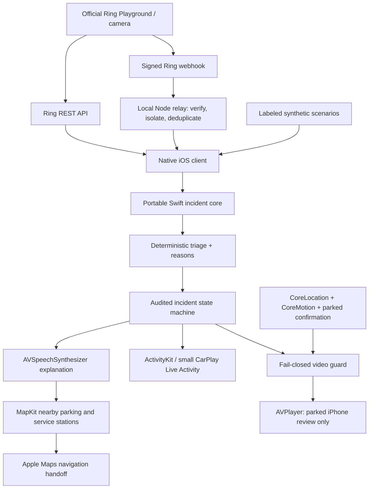

# Ring Drive

A native iPhone hackathon demo: meaningful home activity → spoken explanation → nearby stop → parked confirmation → video review.

Nederlandse startinstructies: [START-HIER.md](START-HIER.md).

**Current status:** the local synthetic demo is runnable without a Ring device or CarPlay entitlement. Official Ring REST calls and a signed webhook relay are implemented, but **a successful authenticated Ring runtime demonstration is still required before submission**. No Ring credentials were available during development. No Apple CarPlay entitlement has been granted or assumed.

## Quick start

Requirements: macOS, Xcode 26 with the iOS 26 simulator, Python 3 for regenerating the project, Node 22+ for the optional relay. No paid cloud service or third-party package is needed.

1. Open `RingDrive.xcodeproj` in Xcode.
2. Select **RingDrive → an iPhone simulator**, then Run. The app and WidgetKit extension are included.
3. Tap **Run rear-door demo**, then **Listen to explanation**. Wait for the spoken explanation to finish.
4. Tap **Find a safe place to stop → Simulate Maps handoff**. Dismiss the explanatory message.
5. Tap **Simulate arrival & standstill**, wait for the real 20-second verification interval, and tap **I'm safely parked**.
6. Tap **Review incident video**. It is an explicitly synthetic rehearsal clip. Backgrounding the app, uncertain sensors or resumed driving revoke video immediately.

The Demo & Ring tab includes the passive package scenario, urgent rear-door scenario, duplicates, low confidence, stale evidence, no stop result, permission denial, Maps failure and uncertain parking. **Resume driving · revoke video** proves the lock returns.

For the actual Apple Maps flow, switch off **Offline stop-search rehearsal** in Demo & Ring. The simulator searches real MapKit parking/service-station results near a disclosed synthetic Amsterdam starting point. Choose **Navigate with Apple Maps**. Search results are candidates, not a promise of availability, safe access or permission to park. Routes are owned by Apple Maps. Arrival never unlocks video.

Open Apple Maps once and complete its first-use screens before recording a demo. These system onboarding screens can cover a successful navigation handoff; they are outside Ring Drive. The synthetic driver mode passes an explicit Amsterdam start point to Maps; physical-device mode uses Maps' current-location origin.

### Command-line build and tests

```sh
swift test
cd Relay
node --test
cd ..
xcodebuild -project RingDrive.xcodeproj -scheme RingDrive \
  -destination 'platform=iOS Simulator,name=iPhone 17 Pro' \
  -derivedDataPath DerivedData CODE_SIGNING_ALLOWED=NO build
xcodebuild -project RingDrive.xcodeproj -scheme RingDrive \
  -destination 'platform=iOS Simulator,name=iPhone 17 Pro' \
  -derivedDataPath DerivedData -parallel-testing-enabled NO \
  CODE_SIGNING_ALLOWED=NO test
```

The project is committed as an ordinary Xcode project. To regenerate it after adding source files: `python3 scripts/generate_project.py`. Demo media is already included; to regenerate the original synthetic footage and icon: `swift scripts/create_demo_media.swift .`.

If `Build/RingDrive.app` is included in this delivery, it is an Apple Silicon **simulator** binary, not a signed iPhone distribution. Install with `xcrun simctl install booted Build/RingDrive.app`, then `xcrun simctl launch booted dev.ringdrive.demo --demo-urgent`.

## Official Ring runtime: required submission step

The [official Amazon starter](https://github.com/AmazonAppDev/ring-api-helloworld) documents a short-lived token from the [Ring Developer Playground](https://developer.amazon.com/ring/console/playground), without full app registration for this token-based development path. Sign in using your own account. If access is gated, request it through the Ring developer portal; do not substitute a community emulator and claim it is official.

1. Open the official Playground and **Generate Token**. Use its official simulated devices if offered to your account, or a supported real Ring device. We did not verify account-specific simulator availability.
2. In the native app, open **Demo & Ring → Official Ring runtime**. Paste the token into the secure field and tap **Connect & discover Ring devices**. The app actually calls `GET https://api.amazonvision.com/v1/devices` using Bearer authentication.
3. Assign each camera a Front/Side/Rear zone. Leave non-camera devices Unknown. This small demo maps zones per device; multi-camera module-specific zone mapping is a follow-up.
4. Trigger official simulator/device activity. Tap **Poll Ring event history**, or start foreground polling every eight seconds. The app calls `GET /v1/history/devices/{id}/events?event_types=motion.human,ding` and feeds fresh observations into the same Swift triage pipeline. A side observation, then repeated rear observations spanning at least sixty seconds, qualifies for urgency.
5. After parking confirmation, review an actual Ring incident. The app makes `POST /v1/devices/{id}/media/video/download` with epoch-millisecond timestamp and duration, optional component selection, and reads the returned MP4 bytes into AVPlayer. A `416` means no recording exists. This endpoint **does not start recording**.
6. Capture the official console, native runtime status, received incident and code call sites in the submission video. Merely showing local synthetic scenarios or a configured token is not proof of Ring runtime usage.

Tokens are stored in iOS Keychain. No token is printed, logged or embedded in the source. Playground tokens expire; generate a fresh one when the app reports 401. For an independent connectivity proof:

```sh
# Set RING_ACCESS_TOKEN in your local shell; do not commit it or put it in screenshots.
node scripts/verify_ring.mjs
```

This writes `runtime-proof.local.json` only after successful official discovery, with redacted identifiers and HTTP result counts. The native app writes a similar local discovery receipt in its Documents directory. A receipt alone does not demonstrate the event → driver experience; record that too.

### Signed webhook relay (optional)

The native app can receive Ring events through a minimal local relay. It verifies the official `X-Signature: sha256=<hex>` HMAC-SHA256 over **original request bytes**, checks the configured account, deduplicates event IDs, acknowledges lifecycle events without forwarding credentials, bounds its queue and filters stale evidence. No AWS infrastructure is needed.

Configure locally:

```sh
export RING_HMAC_KEY='YOUR_PARTNER_HMAC_KEY'
export RING_ACCOUNT_ID='YOUR_RING_ACCOUNT_ID'
export RELAY_CLIENT_TOKEN='YOUR_RANDOM_LOCAL_CLIENT_SECRET'
cd Relay
node server.mjs
```

The relay binds to `127.0.0.1:8787`. Configure your registered Ring app to deliver to an HTTPS tunnel's `/webhooks/ring`. Keep `/events` private; it requires the separate client token. In the simulator app, enter `http://127.0.0.1:8787` and that client token under **Signed webhook relay**, then Fetch. Real phones need an HTTPS relay accessible from the phone. Exposing a relay or registering a webhook is a separate deployment/configuration step, not performed here.

## Architecture



`Sources/RingDriveCore` has no UI dependency. `iOS/App` owns services and effect orchestration. `iOS/Shared` defines ActivityKit payloads. `iOS/Widgets` presents system surfaces. `iOS/CarPlay` is compile-gated. `Relay` handles inbound webhooks. `scripts` contains reproducible project/media generation and genuine Ring connectivity verification.

```
DETECTED → TRIAGED → NOTIFIED → EXPLAINED → STOP_REQUESTED
    → NAVIGATING → PARKED_CONFIRMED → VIDEO_UNLOCKED
```

`EXPLAINED` requires completion of spoken audio; a canceled utterance cannot advance it. A failed Maps handoff stays in `STOP_REQUESTED`; retry is supported. A person already parked may skip navigation after requesting a stop. Motion, stale samples, app backgrounding or new evidence revoke video. New camera evidence requires a fresh explanation. No player or thumbnail is instantiated while locked; Picture in Picture is disabled; media access checks safety before the network request and again before presentation.

### Inspectable triage

| Case | Rule | Result |
|---|---|---|
| Package followed by departure at front door | Confidence ≥ 0.8, no side/rear evidence | Passive; no audible notification |
| Side then rear observations on different cameras/modules | Within 150 s, rear span ≥ 60 s, confidence ≥ 0.7 | Urgent, explanation with reasons |
| Stale (> 180 s), low confidence, missing observations | No qualifying evidence | Review; no urgent interruption |
| Duplicate retry | Account + device + event ID deduplication | No second incident/notification |
| Different households | Account isolation | No cross-household correlation |

Confidence is an inspectable heuristic score, **not a calibrated probability**. All rules use injectable timestamps in tests. Ring metadata does not prove courier identity, package delivery/departure or that two cameras see the same person. The courier demonstration uses explicit synthetic semantic annotations. Official runtime correlation describes observations and states that identity is inferred, not verified. Vision/LLM inference is an extension point; this version does not claim to run a vision model or cloud AI.

### Parking safety policy

Fresh location samples (≤ 3 s), valid speed and speed accuracy, horizontal accuracy ≤ 15 m, speed upper bound ≤ 0.3 m/s, and high-confidence stationary CoreMotion must remain continuous for **20 s**. The user then confirms being safely parked. Missing permission, invalid numbers, gaps or motion invalidate the gate. Simulated sensor samples are accepted only by explicitly configured demo policy; the default core policy rejects them.

iOS does not expose a general-purpose vehicle gear/parking-brake guarantee here. This demo establishes measured standstill plus explicit user confirmation, not certified vehicle telemetry. Device sensing needs real-hardware validation and cannot reliably distinguish every traffic-light or passenger situation. Backgrounding stops video and discards parking evidence; fresh verification is required on return. Sensor mode intentionally fails closed when reliable data is absent.

## Real versus simulated surfaces

| Part | Implementation / status |
|---|---|
| Native client, triage, audit, audio, AVPlayer guard | Real app code, runnable locally |
| Ring device discovery/history/recorded MP4 | Real REST implementation; authenticated runtime validation pending credentials |
| Signed Ring webhook processing | Real local server + HMAC tests; actual Ring delivery pending partner setup |
| Synthetic scenarios and bundled CCTV clip | Locally authored illustration; never labeled Ring recording |
| Demo driving/standstill | Simulated samples, labeled on screen |
| CoreLocation + CoreMotion | Real iOS sensor code; hardware validation pending |
| Offline stop-search/Maps handoff | Explicit synthetic rehearsal |
| Online search and Maps handoff | Real MapKit and Apple Maps calls |
| ActivityKit + WidgetKit extension | Real extension. Live Activity state is dynamic; the ordinary widget is an honest static reminder |
| Interactive CarPlay preview inside the app | Simulated surface, no Apple entitlement needed |
| Full CarPlay scene | Code behind `FULL_CARPLAY`; cannot run in a real CarPlay scene until Apple approves and provisioning is configured |

The app posts standard iPhone local notifications, not a fabricated WhatsApp-style CarPlay messaging category. Actual CarPlay delivery uses the system's Live Activity presentation. Live Activity buttons/toggles are disabled in CarPlay, and opening a full app there requires CarPlay support. We do not claim the entitlement-free MVP supplies an interactive full CarPlay app.

### Actual CarPlay simulator and entitlement steps

1. Use Apple's standalone CarPlay Simulator from Additional Tools for Xcode, paired with the running iOS 26 simulator. Inspect the active Live Activity on CarPlay Home; add the small widget via the system's CarPlay widget settings if available. The separate simulator is not bundled with this project and wasn't installed in this development environment.
2. Apply for the appropriate [CarPlay entitlement](https://developer.apple.com/carplay/). A security use case is not automatically eligible for a supported category; Apple's decision is required.
3. Once approved, use an approved App ID, entitlement and provisioning profile. Set `SWIFT_ACTIVE_COMPILATION_CONDITIONS` to include `FULL_CARPLAY` for the app target and add a `CPTemplateApplicationSceneSessionRoleApplication` scene configuration with `CarPlaySceneDelegate`. Do not invent an entitlement key/category to make an unapproved target appear.
4. Validate the supported templates and interactions on Apple's CarPlay Simulator and real hardware. The scene currently provides voice explanation and safe-stop actions; video review remains on the parked iPhone.
5. For real background events, add persistent backend event storage and APNs/ActivityKit push updates. Foreground polling and local notifications are sufficient for this demo, not reliable suspended-app delivery. Production OAuth linking/refresh, privacy policy and Ring Appstore certification are outside this MVP.

## Demo script — 2 minutes 45 seconds

| Time | Show / say |
|---|---|
| 0:00–0:20 | Show an authenticated official Ring device discovery and event call/receipt, plus the official simulator event. “Ring supplies observations; Ring Drive decides what deserves the driver's attention.” If credentials are absent, this step is a blocker, not something to replace with a fake screenshot. |
| 0:20–0:35 | Run Package delivered. Passive update, no audible interruption. Briefly show its rule reasons. |
| 0:35–1:00 | Run Side entrance → rear door. Show the observation chain and video lock. Open the CarPlay simulation (clearly labeled) or show the actual small Live Activity separately. |
| 1:00–1:25 | Tap Listen and hear the explanation. “It explains why without loading any video.” |
| 1:25–1:45 | Find a stop. For the recorded rehearsal use the offline path; show real MapKit/Maps beforehand if connectivity is reliable. Do not call the rehearsal a real navigation session. |
| 1:45–2:10 | Simulate arrival; show twenty seconds of continuous standstill and disabled parking confirmation. Then confirm safely parked. |
| 2:10–2:30 | Review the clearly synthetic incident clip. For a Ring recording, use the actual API incident instead. |
| 2:30–2:45 | Resume driving or background the app: video disappears and locks. Show audit transitions and duplicate suppression. |

## Verification and blockers

See `docs/VERIFICATION.md` for the executed checks and current limitations. The initial native build encountered an SDK 23B77/runtime 23B80 mapping issue. The official workaround was `xcrun simctl runtime match set iphoneos26.1 23B80 --sdkBuild 23B77`; use this only for that exact locally installed pair. Revert with `xcrun simctl runtime match set iphoneos26.1 --default` when no longer needed. A re-download was blocked by insufficient disk space; existing personal files were not removed. Only temporary files generated for this project were cleaned.

## Primary sources checked 5 October 2026

- [Hackathon rules](https://amazonappdev2026.devpost.com/rules): Ring technology must actually be used and demonstrated; local fixtures alone don't establish eligibility.
- [Official Ring Partner API](https://developer.amazon.com/docs/ring/api-documentation.html): authentication, JSON:API history, raw-body HMAC and recorded MP4 download.
- [Official Ring starter](https://github.com/AmazonAppDev/ring-api-helloworld): Playground token path and runtime calls.
- [Apple: What's new in widgets](https://developer.apple.com/videos/play/wwdc2025/278/): iOS 26 widgets/Live Activities in CarPlay and small activity family.
- [Apple: custom Live Activity views](https://developer.apple.com/documentation/activitykit/creating-custom-views-for-live-activities): supplemental presentation.
- [Apple CarPlay](https://developer.apple.com/carplay/): entitlement approval and supported app categories.

Ring Drive is an independent hackathon concept, not an official Ring or Apple product. No cloud deployment or submission was performed.
