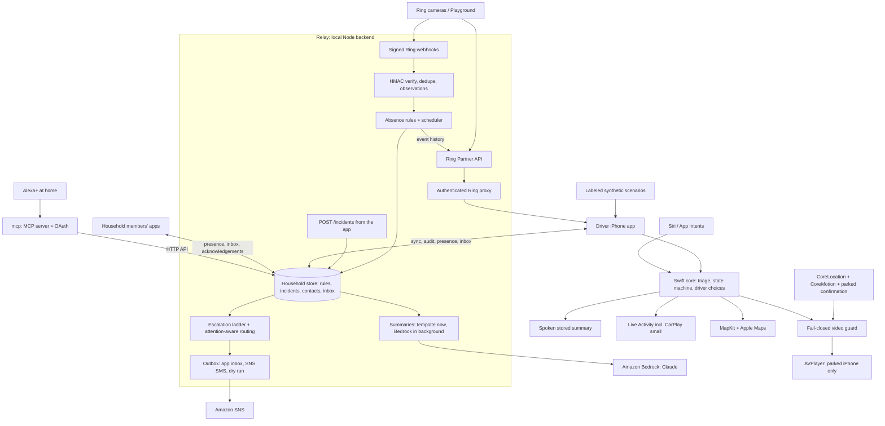

# Ring Drive

Ring Drive turns Ring camera activity, and expected activity that did not happen, into short spoken updates for a driver. The driver hears what the cameras observed, chooses what to do (notify the household, call a contact, find a safe stop or dismiss) by tap or by Siri, and reviews video only after parking. Household members who are not driving are asked first; Alexa+ can answer "what happened while I was away?" at home.

Nederlandse startinstructies: [START-HIER.md](START-HIER.md).

**Current status.**
- The synthetic demo runs without a Ring device or a CarPlay entitlement. Official Ring REST calls run server-to-server through the local Node backend; the app never receives Ring OAuth credentials.
- Amazon Bedrock summaries are wired in but have not yet produced a live answer. The new AWS account was still being verified on 8 October 2026, so summaries fell back to the template. Re-run `node scripts/verify_bedrock.mjs` once verification completes.
- Authenticated Ring runtime and an event-to-driver recording are still required before submission. No Apple CarPlay entitlement has been granted or assumed.
- Swift changes since 7 October have been compiled and checked only as far as possible without Xcode on this Mac. See [Verification and blockers](#verification-and-blockers) and [docs/friction-log.md](docs/friction-log.md).

## Components

| Path | What it is |
|---|---|
| `iOS/App` | SwiftUI iPhone app: Drive, Incidents, Demo & Ring and Household tabs, spoken explanations, Maps handoff, parking-gated video, driving detection, App Intents for Siri |
| `iOS/Widgets`, `iOS/Shared` | Live Activity (lock screen, Dynamic Island, small CarPlay presentation) and a static widget |
| `iOS/CarPlay` | Full CarPlay scene, compiled only with `FULL_CARPLAY` after Apple approval |
| `Sources/RingDriveCore` | Portable Swift core: triage, incident state machine with driver choices, parking safety, timeline, backend clients |
| `Relay` | Node 22 backend: Ring OAuth and REST proxy, signed webhooks, absence rules, incident store, Bedrock summaries, contacts, escalation ladders, household inbox, SNS SMS |
| `mcp` | Self-hosted MCP server (Streamable HTTP, protocol 2025-11-25) for Alexa+ at home, with its own OAuth server |
| `scripts` | Setup, Ring and Bedrock verification, rules and household CLIs, demo scenarios, project and media generation |

## Setup and run

Requirements: macOS with **Xcode 26** (iOS 26 SDK and simulator), **Node 22+**, Python 3 (only to regenerate the Xcode project). Optional: a Ring Developer Playground token, an AWS account with Bedrock access, and an iPhone for sensors, Siri and CarPlay.

**1. Backend (`Relay`)**

```sh
node scripts/setup_ring.mjs                 # creates Git-ignored Relay/.env.local (mode 600) with generated keys
cd Relay && npm install
node --env-file=.env.local server.mjs       # http://127.0.0.1:8787, loopback only
```

Settings live in `Relay/.env.local` (template: `Relay/.env.example`):

| Settings | Purpose |
|---|---|
| `RING_ACCESS_TOKEN` (+ optional refresh, client and HMAC settings) | Official Ring API (see below) |
| `AWS_REGION`, `AWS_ACCESS_KEY_ID`, `AWS_SECRET_ACCESS_KEY`, `BEDROCK_MODEL_ID` | Bedrock summaries |
| `DRY_RUN` | Which outgoing channels are recorded but not sent (default `sms`) |
| `SIMULATION_ENABLED=1` | Allows the labeled simulation endpoint |
| `DATA_FILE` | Household store; default `Relay/data/household.local.json`, Git-ignored |

**2. iPhone app**

1. Open `RingDrive.xcodeproj` and run **RingDrive** on an iPhone simulator (or on a device with your Personal Team; see below).
2. In **Demo & Ring**, enter the backend URL (`http://127.0.0.1:8787` on the simulator) and the `RELAY_CLIENT_TOKEN` from `.env.local`. Tap **Save key for household features**, or **Connect & discover Ring devices** when a Ring token is configured.
3. In **Household**, choose who this iPhone belongs to. Keep **Dry-run calls** on unless you want real calls.

To try the synthetic flow without any backend:
1. Tap **Run rear-door demo**, then **Listen to explanation**, and wait for the spoken explanation to finish.
2. Choose **Find a safe place to stop**, then **Simulate Maps handoff**.
3. Tap **Simulate arrival & standstill**, wait the real 20 seconds, and tap **I'm safely parked**.
4. Tap **Review incident video**. Backgrounding the app, uncertain sensors or resumed driving relock the video immediately.

The Demo & Ring tab also has the passive package scenario, the multi-camera scenario, duplicates, low confidence, stale evidence and fault switches.

**3. Amazon Bedrock**: see [Incident summaries with Amazon Bedrock](#incident-summaries-with-amazon-bedrock); check with `node scripts/verify_bedrock.mjs`.

**4. Household and rules**: `node scripts/household.mjs …` and `node scripts/rules.mjs …`; see [Absence rules](#absence-rules-expected-activity) and [Household contacts](#household-contacts-and-attention-aware-routing).

**5. MCP server for Alexa+**: `node scripts/setup_mcp.mjs`, then `cd mcp && npm install && node server.mjs`. See [Alexa+ at home](#alexa-at-home-ring-drive-mcp-server).

**6. Tests**

```sh
cd Relay && npm test              # backend: rules, summaries, state machine, escalation, Ring proxy, webhooks
cd mcp && npm test                # MCP protocol, tools and OAuth
swift test                        # Swift core (needs Xcode: XCTest is not part of the Command Line Tools)
```

**7. Demo scenarios**: `npm --prefix Relay run demo:0815` and `npm --prefix Relay run demo:multicam`; see [Demo scenarios](#demo-scenarios-one-command-each).

### Command-line builds

```sh
swift test
cd Relay
node --test
cd ..
xcodebuild -project RingDrive.xcodeproj -scheme RingDrive \
  -destination 'platform=iOS Simulator,name=iPhone 17 Pro' \
  -derivedDataPath DerivedData CODE_SIGNING_ALLOWED=NO build
xcodebuild -project RingDrive.xcodeproj -scheme RingDrive \
  -destination 'platform=iOS Simulator,name=iPhone 17 Pro' \
  -derivedDataPath DerivedData -parallel-testing-enabled NO \
  CODE_SIGNING_ALLOWED=NO test
```

The project is committed as an ordinary Xcode project. To regenerate it after adding source files: `python3 scripts/generate_project.py`. Demo media is already included; to regenerate the original synthetic footage and icon: `swift scripts/create_demo_media.swift .`.

If `Build/RingDrive.app` is included in this delivery, it is an Apple Silicon **simulator** binary, not a signed iPhone distribution. Install with `xcrun simctl install booted Build/RingDrive.app`, then `xcrun simctl launch booted dev.ringdrive.demo --demo-urgent`.

### Physical iPhone and remote installation

The app and widget also compile for physical arm64 iPhones; the project's minimum iOS version is **26.0**. This has been checked with an unsigned Release build, not installation or hardware sensing. No development/distribution signing identity or team is configured on this Mac, and no installable IPA or TestFlight build has been produced.

For local testing, connect the iPhone to your Mac, sign in to Xcode with your Apple Account, select your Personal Team for both targets under Signing & Capabilities, enable Developer Mode when prompted, and Run on the phone. Xcode may require unique bundle identifiers. Apple's free Personal Team supports local device testing with provisioning that expires after seven days. Remote TestFlight installation requires Apple Developer Program membership, distribution signing and an App Store Connect upload. External testing additionally requires the first build's beta review. See [Apple's account overview](https://developer.apple.com/help/account/basics/about-your-developer-account) and [TestFlight](https://developer.apple.com/testflight/).

After installation, **Run rear-door demo** enables simulated vehicle evidence and works without the backend. Real Ring events require an authenticated HTTPS backend reachable by the phone; its `127.0.0.1` is not the Mac. No backend has been publicly deployed. Full CarPlay provisioning is a separate dependency from signing the ordinary iPhone app.

## Official Ring runtime: required submission step

The [official Amazon starter](https://github.com/AmazonAppDev/ring-api-helloworld) documents a short-lived token from the [Ring Developer Playground](https://developer.amazon.com/ring/console/playground), without full app registration for this token-based development path. Sign in using your own account. If access is gated, request it through the Ring developer portal; do not substitute a community emulator and claim it is official.

1. Open the official Playground and **Generate Token**. Use the access token value without the `Bearer ` prefix. One user-scoped access token is used for Device List, Event History and Users API; there is no separate token per endpoint.
2. Run `node scripts/setup_ring.mjs` once. It creates private, Git-ignored `Relay/.env.local` without overwriting existing configuration. Fill only `RING_ACCESS_TOKEN` locally for the simulator path. Never paste credentials into chat. Start the backend with `cd Relay && node --env-file=.env.local server.mjs`. It binds only to `127.0.0.1:8787`.
3. In **Demo & Ring → Official Ring runtime**, use backend URL `http://127.0.0.1:8787` and the separate `RELAY_CLIENT_TOKEN` generated in the local file. Tap **Connect & discover Ring devices**. The backend actually calls Ring's `GET /v1/users/me` and `GET /v1/devices`. It keeps only the account identity from the user profile; email, name and phone are not forwarded. The backend client key is stored in iOS Keychain; it is not a Ring token.
4. Assign each camera a Front/Side/Rear zone. Leave non-camera devices Unknown. This small demo maps zones per device; multi-camera module-specific zone mapping is a follow-up.
5. Trigger official simulator/device activity. Tap **Poll Ring event history**, or start foreground polling every eight seconds. The backend calls `GET /v1/history/devices/{id}/events?event_types=motion.human,ding` and the app feeds fresh observations into the same Swift triage pipeline, bound to the verified account ID. A side observation, then repeated rear observations spanning at least sixty seconds, qualifies for urgency.
6. After parking confirmation, review an actual Ring incident. The native safety guard allows the backend request only with a fresh parked verdict. The backend validates the consented device and makes `POST /v1/devices/{id}/media/video/download` with epoch-millisecond timestamp and duration, optional component selection, and returns the MP4 bytes to AVPlayer. A `416` means no recording exists. This endpoint **does not start recording**. A native parking marker is an additional request check, not independently attested vehicle telemetry.
7. Capture the official console, native runtime status, received incident and code call sites in the submission video. Merely showing local synthetic scenarios or a configured token is not proof of Ring runtime usage.

All calls to Amazon Vision and Ring OAuth originate on the backend, as required by the [official API documentation](https://developer.amazon.com/docs/ring/api-documentation.html). Playground access tokens expire; replace `RING_ACCESS_TOKEN` in the local file and restart the backend. Client ID and client secret are unnecessary for this short-lived simulator path. If Ring also issued a refresh token for the registered app, fill the optional refresh/client fields; the backend refreshes once on expiry, verifies the same account and saves rotated credentials using AES-256-GCM in private, ignored `tokens.local.enc`. The generated encryption key stays in `.env.local`. For an independent server-side connectivity proof:

```sh
# Reads Relay/.env.local without printing its contents.
node scripts/verify_ring.mjs
```

This writes `runtime-proof.local.json` only after successful official user identity and device discovery, with redacted identifiers and HTTP result counts. History failures are recorded honestly and cause a nonzero exit. The native app can save the backend's redacted receipt; injected test transports cannot create official runtime proof. A receipt alone does not demonstrate the event → driver experience; record that too. Packaging excludes `.env.local`, encrypted tokens and local receipts.

### Signed webhook relay (optional)

The native app can receive Ring events through a minimal local relay. It verifies the official `X-Signature: sha256=<hex>` HMAC-SHA256 over **original request bytes**, checks the configured account, deduplicates event IDs, acknowledges lifecycle events without forwarding credentials, bounds its queue and filters stale evidence. Accepted events are also kept as positive evidence for absence rules.

Configure locally:

```sh
# Fill RING_HMAC_KEY in Relay/.env.local; RING_ACCOUNT_ID is optional
# and, when supplied, must match the authenticated Users API identity.
cd Relay
node --env-file=.env.local server.mjs
```

Connect the backend account first; unsigned, unsupported, stale or wrong-account deliveries are never promoted to incidents. Official event types are `motion_detected` and `button_press`. Configure your registered Ring app to deliver to an HTTPS tunnel's `/webhooks/ring`. Expose only that path for the webhook demo. `/events`, `/ring/*` and runtime receipts require the separate client key. Use **Fetch signed Ring events** on the same verified native connection. Real phones need an HTTPS backend accessible from the phone. Exposing a backend or registering a webhook is a separate deployment/configuration step, not performed here.

## Features

### Parked incident timeline and ongoing updates

**Incident timeline** is a native chronological view of camera observations, immutable assessment snapshots with escalation reasons, and audited driver actions. It resolves the latest incident by ID rather than retaining a stale view snapshot. It is available only with fresh continuous standstill and explicit parking confirmation; motion, uncertainty and backgrounding replace the entire evidence surface with its lock. The driving screen shows a short summary and at most three recent observations.

Expand an observation after parking to see camera name/module, source, timestamp, evidence score and event identifier. For the current incident, **Review this camera moment** requests its camera and timestamp through the existing guarded Ring MP4 path. Synthetic observations instead offer an explicitly illustrative bundled clip. Saved older incident timelines retain metadata; media review currently uses the current incident's authorization. No thumbnails, AI analysis or new Ring snapshot integration were added. Legacy saved incidents migrate to a clearly marked recovered assessment; unavailable historical decisions are not invented.

Fresh events for one household update the same incident and append assessments without repeating urgent alerts or resetting an acknowledged explanation/navigation step. Official history and webhook observations can join; synthetic and real evidence cannot. An unresolved urgent episode survives a long gap rather than silently disappearing. Separate non-urgent or resolved episodes use a 180-second grouping gap. A material escalation or reopening requires a new spoken explanation and revokes any video authorization; an old speech completion cannot acknowledge a newer revision. A route already handed to Apple Maps is not automatically changed.

Resolution requires two distinct `departed` observations with evidence score at least 0.8, from the latest active camera/module, after the latest activity and at least 10 seconds apart. Urgent rear-door episodes additionally require rear-camera evidence. New motion/person/doorbell evidence between checks, even uncertain evidence, blocks resolution. Silence and stale evidence never prove departure. Resolution removes the prior urgent notification and updates the Live Activity silently, without unlocking video or asserting that the home is safe. Fresh activity after departure reopens the same episode; a repeated urgent alert is allowed only on reopening after a 120-second cooldown. Alert counts record requests, not guaranteed system delivery or audible playback. All Live Activity updates are silent.

The existing Ring motion/doorbell adapters do not manufacture departure annotations. Automatic resolution is demonstrated with labeled synthetic evidence until a future vision/review adapter supplies explicit observations; image analysis is outside this change. In **Demo & Ring → Update this synthetic incident**, exercise continuing activity, uncertain activity, duplicate delivery, two departure observations (real 10-second wait) and returning activity. Source changes, backgrounding and starting another scenario cancel the synthetic departure rehearsal.

For the actual Apple Maps flow, switch off **Offline stop-search rehearsal** in Demo & Ring. The simulator searches real MapKit parking/service-station results near a disclosed synthetic Amsterdam starting point. Choose **Navigate with Apple Maps**. Search results are candidates, not a promise of availability, safe access or permission to park. Routes are owned by Apple Maps. Arrival never unlocks video.

Open Apple Maps once and complete its first-use screens before recording a demo. These system onboarding screens can cover a successful navigation handoff; they are outside Ring Drive. The synthetic driver mode passes an explicit Amsterdam start point to Maps; physical-device mode uses Maps' current-location origin.

### Absence rules ("expected activity")

An absence rule fires when something expected does **not** happen. Example: on school days, someone is normally seen at an exit between 07:30 and 08:15. Rules run on the backend, so they work while the phone is asleep.

- **Rule fields:** `name`, `personLabel`, `daysOfWeek`, `window` (`HH:MM`–`HH:MM`, same day), `timeZone` (IANA), `exitCameras` (every exit, each with a Ring `deviceId` and a spoken `label`), `expectedEventType` (`motion.human`, or `motion` for cameras without Ring Smart Alerts), `graceSeconds` (default 120) and `evidenceSource` (`ring` or `simulated`). See `docs/examples/absence-rule.example.json`.
- **Evaluation:** after `window.end + graceSeconds`, the backend reads `GET /v1/history/devices/{id}/events?event_types=<expected>` for **every** exit camera back to the window start, following `links.next`. Any overlapping observation at any exit camera satisfies the rule. Signed webhook observations count as positive evidence too.
- **Fail closed:** if any camera's history cannot be read (expired Playground token, Ring error, too many pages), the window is recorded as `unchecked`, retried every 5 minutes up to 6 times, and **never** turned into an absence alert.
- **What Ring can and cannot tell us:** Ring reports person/motion observations per camera with timestamps. It does not identify people or the direction of movement. The `personLabel` is therefore used only for wording and, later, routing. Alerts state only what the cameras did not record, e.g. *"School run: No person was detected at the front door, the side gate or the back door between 07:30 and 08:15. The cameras cannot show where anyone is."*
- **Output:** an `ABSENCE` incident (`GET /incidents`) with a stored spoken summary, and one run per rule window (`GET /rules/{id}/runs`).

Backend routes (all require the `RELAY_CLIENT_TOKEN` bearer): `GET/POST /rules`, `GET/PUT/DELETE /rules/{id}`, `GET /rules/{id}/runs`, `POST /rules/{id}/evaluate` (`{"date":"YYYY-MM-DD"}`, ended windows only), `GET /incidents`, `GET /incidents/{id}`, and `POST /simulate/observations` (only with `SIMULATION_ENABLED=1`; simulated evidence never satisfies a `ring` rule and simulated incidents are labeled). Data is stored in Git-ignored `Relay/data/household.local.json` (mode 600).

```sh
cd Relay && node --env-file=.env.local server.mjs     # terminal 1
node scripts/rules.mjs add docs/examples/absence-rule.example.json
node scripts/rules.mjs list
node scripts/rules.mjs evaluate <rule-id> 2026-10-07   # check an ended window now
node scripts/rules.mjs incidents
```

A native rules screen is not included yet; rules are managed through this API.

### Incident summaries with Amazon Bedrock

When the backend creates an incident (an absence rule fires) or the driver app syncs a camera incident (`POST /incidents`), the backend immediately stores a deterministic template summary and starts one Amazon Bedrock request in the background. A valid model answer replaces the template. When the driver taps **Listen** (or asks Siri), the app speaks the stored text from `GET /incidents/{id}/summary`; it never waits for Bedrock. If the stored summary was generated for an older set of observations, the app speaks its local explanation instead.

| Item | Value |
|---|---|
| Service | Amazon Bedrock Runtime, `InvokeModel` (Anthropic Messages format) |
| Client | `@anthropic-ai/bedrock-sdk` (`AnthropicBedrock`), called in `Relay/summary.mjs` → `Summarizer.summarize` |
| Model | `BEDROCK_MODEL_ID`, default `anthropic.claude-opus-5-5` (Claude Opus 5.5), effort `low`. `anthropic.claude-haiku-5-5` also works with the same code. |
| Region | `AWS_REGION` (for example `eu-central-1` or `us-east-1`). Use the bare model ID or the `global.` profile; the `eu.` prefix is rejected for these models. |
| Credentials | Standard AWS chain: `AWS_ACCESS_KEY_ID`/`AWS_SECRET_ACCESS_KEY` in `Relay/.env.local`, `AWS_PROFILE`, or `AWS_BEARER_TOKEN_BEDROCK`. Never committed. |
| Timeout | `BEDROCK_TIMEOUT_MS`, default 15 000 ms; one SDK retry |
| Disable | `BEDROCK_ENABLED=0` (template only) |

Least-privilege IAM policy for the backend user or role:

```json
{
  "Version": "2012-10-17",
  "Statement": [{
    "Effect": "Allow",
    "Action": ["bedrock:InvokeModel"],
    "Resource": ["arn:aws:bedrock:*::foundation-model/*", "arn:aws:bedrock:*:*:inference-profile/*"]
  }]
}
```

**Input.** The model receives only JSON facts: camera labels, the order of observations, `HH:MM` times in the household time zone, durations in seconds, and for absences the rule name, window and exit cameras. Person labels, device IDs, account IDs and video never leave the backend.

**System prompt** (`SYSTEM_PROMPT` in `Relay/summary.mjs`):

```text
You write short spoken alerts that a driver hears through the car speakers. The input is JSON facts from home security cameras.

Rules:
- Describe only what the facts say the cameras observed: which cameras, in what order, at what times, and for how long.
- Never speculate about who someone is, what they intend, or whether anyone is in danger. Never use words such as burglar, intruder, thief, stranger, suspicious, break-in, threat or danger.
- For an absence, say which cameras recorded no activity during the window. Never say where any person is, and never say that someone has or has not left.
- Use only times and durations that appear in the facts. Write times as HH:MM and durations in whole seconds.
- If the facts say the video is locked, end by saying the video stays locked until the driver is parked.
- Write two or three short sentences of plain spoken English, at most 60 words, with no lists, markdown, or quotation marks.
```

**Output checks before storing.** The response must end normally (`end_turn`), be at most four sentences and 450 characters, contain no speculative words (burglar, intruder, suspicious, stranger, threat…), make no claims about where a person is for absences, contain no list or markdown formatting, and mention only times and durations present in the facts. Anything else, as well as errors, refusals and timeouts, falls back to the deterministic template, with the reason stored in `summary.fallbackReason`.

Check the live integration without printing credentials:

```sh
node scripts/verify_bedrock.mjs
```

### Household contacts and attention-aware routing

**Contacts** (`/contacts`, `scripts/household.mjs`): `name`, `role` (`household`, `monitored`, `emergency`, `neighbour`), `priority` (1 = first) and `channel`: `app` (the member's Ring Drive inbox), `sms` (Amazon SNS) or `call` (only ever started by the driver). Each household member's iPhone selects who it belongs to in the **Household** tab.

**Driving detection** (`DrivingMonitor` in `iOS/App/PlatformServices.swift`, decision in `DrivingSignal`): a CarPlay audio route (`AVAudioSession` output port `.carAudio`, observed through route-change notifications) or CoreMotion automotive activity at medium or high confidence means "driving". Each app reports this to `POST /members/{id}/status`; reports expire after 10 minutes. Demo mode uses the labeled simulated vehicle instead. Neither sensor path could be exercised in this environment; see the friction log.

**Escalation ladder per absence rule** (`escalation` on the rule; default below). Example for the 08:15 rule:

```json
"escalation": [
  { "target": "monitored", "message": "School starts in 15 minutes" },
  { "target": "household", "afterSeconds": 300 },
  { "target": "driver",    "afterSeconds": 300 }
]
```

1. The monitored person gets the reminder and can answer **I'm on my way**.
2. If nobody acknowledges within the delay, household members who are **not driving** are messaged (members with unknown state only if nobody is known to be free; members known to be driving never get a household step).
3. Only then is the driver alerted: the incident moves to `NOTIFIED`, the driver app adopts it, speaks the stored summary and shows the Live Activity.

Any acknowledgement stops the ladder before the driver is interrupted and is recorded on the incident timeline ("Sanne has seen this", "Sanne replied: on my way"). Steps with nobody to reach are skipped immediately. The driver's **Notify household** choice calls `POST /incidents/{id}/notify-household`, which messages household members who are not driving and never the requesting member; the driver hears who was reached, or that everyone appears to be driving.

**Delivery and dry run** (`Relay/outbox.mjs`). `DRY_RUN` lists channels that are recorded on the timeline but not delivered (`all`, `none`, or `app,sms`; default `sms`). Remote push needs APNs, which requires a paid Apple Developer Program membership, so household messages reach the other members' apps through a backend inbox (`GET /members/{id}/inbox`), polled while the app is open and shown as a local notification. SMS uses Amazon SNS `Publish` when enabled and permitted (`sns:Publish`).

**Calls.** **Call a contact** lists contacts with a valid E.164 number (emergency contacts and neighbours first) and opens a standard `tel:` link, for which iOS always asks the user to confirm. No workaround is used. **Dry-run calls** (Household tab, on by default) records the choice and shows who would be called without opening the phone app.

```sh
node scripts/household.mjs add-contact Sanne monitored
node scripts/household.mjs add-contact Thomas household
node scripts/household.mjs add-contact Oma emergency call +31600000000
node scripts/household.mjs contacts
node scripts/household.mjs driving <contact-id> yes      # simulated presence for demos
node scripts/household.mjs notifications <incident-id>
```

### Hands-free choices with Siri (App Intents)

The driver choices are App Intents with App Shortcuts (`iOS/App/Intents.swift`), so Siri can run them, including through CarPlay, without a CarPlay entitlement. They run in the app process without opening the app (`openAppWhenRun = false`) and never show video.

| Intent | Example phrase | What it does |
|---|---|---|
| `ExplainLatestIncidentIntent` | "Explain my Ring Drive alert" | Siri speaks the stored summary (Bedrock or template). This counts as hearing the explanation, and Siri lists the next options. |
| `NotifyHouseholdIntent` | "Notify my household with Ring Drive" | Records `NOTIFY_HOUSEHOLD`, messages household members who are not driving, and says who was reached. |
| `CallContactIntent` (contact parameter) | "Call a contact with Ring Drive" | Siri asks which contact; records `CALL_CONTACT` and opens a `tel:` link with `OpenURLIntent`, where iOS asks for confirmation. With dry-run calls on, Siri says who would be called instead. |
| `FindSafeStopIntent` | "Find a safe stop with Ring Drive" | Records `FIND_STOP` and hands a parking search near the current (or labeled demo) location to Apple Maps. Arrival never unlocks video. |

Choices that the current incident does not offer, or that come before the explanation, are refused with a spoken reason. Each Siri choice is stored on the timeline with "(Siri)".

The **Live Activity** (`iOS/Widgets`, also shown in CarPlay's small presentation on iOS 26) now shows the incident type, the current stage as the next spoken action ("Ask Siri: “Ring Drive explain”", "Next: notify household · call a contact", "Household notified", "Navigating to a stop · video locked") and the escalation outcome ("Notified Thomas", "Sanne has seen this", "Sanne is on the way"). All updates stay silent.

**Verification status and limitations.** `Intents.swift` type-checks unchanged against the AppIntents SDK, and the shared logic is unit-checked, but no iOS build or Siri run was possible in this environment (no Xcode). Apple's CarPlay Simulator connects to a physical iPhone over USB. To verify:

1. Install the app on an iPhone, open it once and set **Household → This iPhone belongs to**.
2. Connect the iPhone to the CarPlay Simulator (or a car), trigger the 08:15 demo, and say "Hey Siri, explain my Ring Drive alert".
3. Check that Siri speaks the summary, that "Notify my household with Ring Drive" reaches a member who is not driving, and that the Live Activity stage changes.
4. Test "Call a contact" and "Find a safe stop" with dry-run calls off. Whether CarPlay Siri accepts `OpenURLIntent` for `tel:` and Maps links is not yet confirmed; Siri's built-in "Call Oma" and "Find parking" remain the fallback.

### Alexa+ at home: Ring Drive MCP server

`mcp/` is a separate, self-hosted [Model Context Protocol](https://modelcontextprotocol.io) server (Streamable HTTP, protocol `2025-11-25`, `@modelcontextprotocol/sdk`) so a household member at home can ask "Alexa, what happened while I was away?". It reads the backend only through its authenticated HTTP API, never changes the driver's incident state, and never exposes video.

| Tool | What it returns or does |
|---|---|
| `get_recent_incidents` (`hours`, `limit`) | Incidents with their stored summary (the in-car video sentence removed), the driver's current step and who acknowledged them. Read-only. |
| `get_incident_timeline` (`incident_id`) | Camera observations per camera, escalation steps, household acknowledgements and driver choices in time order. Read-only. |
| `acknowledge_incident` (`incident_id`, optional `note`) | Records "seen at home" (`POST /incidents/{id}/acknowledge`), stops a running escalation, and is idempotent. |

**Authentication.** Local MCP clients use a static bearer token (`MCP_TOKEN`). Alexa+ requires OAuth, so `mcp/oauth.mjs` provides a minimal single-household authorization server:
- discovery metadata: `/.well-known/oauth-authorization-server` and `/.well-known/oauth-protected-resource`
- Tier 1 `client_credentials` with scope `mcp:service`, which allows initialize and tools/list only
- Tier 2 `authorization_code` with PKCE S256 with scope `mcp:tools`, after the household owner approves on `/authorize` with `MCP_OWNER_PASSWORD`
- one-hour access tokens and rotating refresh tokens, stored hashed in Git-ignored `mcp/data/`

Tool calls with a Tier 1 token get `403 insufficient_scope`. DNS-rebinding protection accepts only the configured hosts.

```sh
node scripts/setup_mcp.mjs                     # adds MCP_TOKEN, OAuth client secret and owner password to Relay/.env.local
cd mcp && npm install && npm test
cd mcp && node server.mjs                      # http://127.0.0.1:8790/mcp; needs the backend running
```

To connect Alexa+, expose the server over HTTPS (for example `cloudflared tunnel --url http://127.0.0.1:8790`), set `MCP_PUBLIC_URL` to that URL, add its host to `MCP_ALLOWED_HOSTS`, and register an add-on with the Alexa AI CLI. Give it the client ID and secret, and set `MCP_REDIRECT_URIS` to the redirect URIs Alexa+ shows. This last step was not performed here; see the friction log.

### Registered-app linking and documentation MCP

For remote token delivery, `node scripts/create_token_input.mjs` creates a standalone `../Ring-token-invoer.html` containing only this workspace's public key. Download and open it locally in a current browser, paste the access token there and send only the `RINGDRIVE-TOKEN-BOX:` encrypted envelope back. The page uses WebCrypto RSA-OAEP SHA-256 to wrap a new AES-256-GCM key for each message; it has no imports, storage or network calls and a restrictive CSP. Its private key remains in ignored `Relay/.secrets/` with private permissions. `scripts/import_ring_token.mjs` imports an envelope from `Relay/.secrets/incoming.local.txt` without printing plaintext. This is a local demo handoff utility, not a deployed identity service. File-preview viewers may disable JavaScript; use a real browser on a computer when needed.

The demo uses a user-consented simulator access token. It does not implement a complete production Ring Appstore linking portal. Client ID and secret alone are not a Bearer token, and no undocumented `client_credentials` grant is used. Standard Ring linking additionally requires public HTTPS token-exchange/account-link endpoints, partner sign-in, time-bound HMAC nonce matching, then POST and mandatory PATCH to complete app integration. Partner-initiated PKCE is invitation-only; do not assume this app is allowlisted. Refresh support here is backend-only and does not claim those linking steps have been completed.

The [Ring knowledge MCP](https://developer.amazon.com/docs/ring/ring-mcp.html) answers documentation questions. It is separate from camera API access and is not hackathon runtime proof. The supplied JSON can be used by the clients documented by Ring. Codex's documented equivalent is:

```toml
[mcp_servers.ring-appstore-knowledge-mcp-server]
url = "https://knowledge.appstore-mcp.ring.amazon.dev/mcp"
```

See [Codex MCP setup](https://developers.openai.com/learn/docs-mcp) for the supported configuration/CLI route. Configuration alone does not make tools available in an already running chat. This demo does not install or claim an active MCP connection.

## Architecture



`Sources/RingDriveCore` has no UI dependency and includes the native backend transports (`RingAPI`, `HouseholdAPI`), driver choices (`DriverChoices.swift`), household types and driving decision (`Household.swift`) and Live Activity texts (`ActivityText.swift`). `iOS/App` owns services and effect orchestration, including `DrivingMonitor` and the App Intents. The backend owns absence rules (`absence.mjs`, `scheduler.mjs`), the incident store (`store.mjs`), summaries (`summary.mjs`), the mirrored state machine (`state-machine.mjs`), contacts and escalation (`contacts.mjs`, `escalation.mjs`, `outbox.mjs`) and the HTTP API (`api.mjs`). `iOS/Shared` defines ActivityKit payloads. `iOS/Widgets` presents system surfaces. `iOS/CarPlay` is compile-gated. `Relay` owns Ring credentials, server-to-server REST/OAuth refresh and signed inbound webhooks. `scripts` contains reproducible project/media generation, credential setup, safe packaging and genuine Ring connectivity verification.

`Timeline.swift` provides stable chronological item identities and the shared parked-evidence guard. `IncidentUpdates.swift` holds inspectable episode, resolution and interruption policy. `Incident` persists every assessment's original evidence references, status, required explanation revision and alert cooldown alongside its existing transition audit.

```
DETECTED → TRIAGED → NOTIFIED → EXPLAINED ─┬─ NOTIFY_HOUSEHOLD → HOUSEHOLD_NOTIFIED ─┐
                                           ├─ CALL_CONTACT     → CONTACT_CALLED     ─┤ (further choices)
                                           ├─ FIND_STOP        → STOP_REQUESTED → NAVIGATING → PARKED_CONFIRMED → VIDEO_UNLOCKED
                                           └─ DISMISS          → DISMISSED (final)
```

After the spoken explanation the driver makes explicit choices. Each incident type defines what it offers (`ChoicePolicy` in `Sources/RingDriveCore/DriverChoices.swift`, mirrored in `Relay/state-machine.mjs`):

| Incident | Offered choices |
|---|---|
| Absence rule (`ABSENCE`) | Notify household, Call a contact, Dismiss. No stop or video path; absence incidents can never unlock video. |
| Urgent camera incident | Find a safe place to stop, Notify household, Call a contact, Dismiss |
| Review or passive camera incident, or resolved activity | Find a safe place to stop, Dismiss |

From `HOUSEHOLD_NOTIFIED` or `CONTACT_CALLED` the driver can still take the other offered choices, find a stop, or dismiss. Every choice is stored as an audit entry with its timestamp and choice (`AuditEntry.choice`), shown in the parked timeline as "Driver chose: …", and mirrored to the backend (`POST /incidents/{id}/audit`, idempotent per entry id). The backend enforces the table strictly for absence incidents, which it owns, and records camera-incident transitions as reported by the phone, which owns the parking-safety checks. Escalated or reopened evidence returns the incident to `NOTIFIED`: the driver hears the update and chooses again. Video stays locked while driving; the parked logic is unchanged.

`EXPLAINED` requires completion of spoken audio; a canceled utterance cannot advance it. A failed Maps handoff stays in `STOP_REQUESTED`; retry is supported. A person already parked may skip navigation after requesting a stop. Motion, stale samples, app backgrounding, escalation or reopened activity revoke video. Escalation and reopened activity require a fresh explanation; continued activity updates the same incident quietly. No player or thumbnail is instantiated while locked; Picture in Picture is disabled; media access checks safety before the network request and again before presentation.

### Inspectable triage

| Case | Rule | Result |
|---|---|---|
| Package followed by departure at front door | Confidence ≥ 0.8, no side/rear evidence | Passive; no audible notification |
| Side then rear observations on different cameras/modules | Within 150 s, rear span ≥ 60 s, confidence ≥ 0.7 | Urgent, explanation with reasons |
| Stale (> 180 s), low confidence, missing observations | No qualifying evidence | Review; no urgent interruption |
| Duplicate retry | Account + device + event ID deduplication | No second incident/notification |
| Different households | Account isolation | No cross-household correlation |

Confidence is an inspectable heuristic score, **not a calibrated probability**. All rules use injectable timestamps in tests. Ring metadata does not prove courier identity, package delivery/departure or that two cameras see the same person. The courier demonstration uses explicit synthetic semantic annotations. Official runtime correlation describes observations and states that identity is inferred, not verified. Triage stays deterministic; Amazon Bedrock only phrases the stored spoken summary from the same observations and is checked against them. No vision model is used.

### Parking safety policy

Fresh location samples (≤ 3 s), valid speed and speed accuracy, horizontal accuracy ≤ 15 m, speed upper bound ≤ 0.3 m/s, and high-confidence stationary CoreMotion must remain continuous for **20 s**. The user then confirms being safely parked. Missing permission, invalid numbers, gaps or motion invalidate the gate. Simulated sensor samples are accepted only by explicitly configured demo policy; the default core policy rejects them.

iOS does not expose a general-purpose vehicle gear/parking-brake guarantee here. This demo establishes measured standstill plus explicit user confirmation, not certified vehicle telemetry. Device sensing needs real-hardware validation and cannot reliably distinguish every traffic-light or passenger situation. Backgrounding stops video and discards parking evidence; fresh verification is required on return. Sensor mode intentionally fails closed when reliable data is absent.

## Real versus simulated surfaces

| Part | Implementation / status |
|---|---|
| Native client, triage, audit, audio, AVPlayer guard | Real app code, runnable locally |
| Ring device discovery/history/recorded MP4 | Real REST implementation; authenticated runtime validation pending credentials |
| Signed Ring webhook processing | Real local server + HMAC tests; actual Ring delivery pending partner setup |
| Synthetic scenarios and bundled CCTV clip | Locally authored illustration; never labeled Ring recording |
| Demo driving/standstill | Simulated samples, labeled on screen |
| CoreLocation + CoreMotion | Real iOS sensor code; hardware validation pending |
| Offline stop-search/Maps handoff | Explicit synthetic rehearsal |
| Online search and Maps handoff | Real MapKit and Apple Maps calls |
| ActivityKit + WidgetKit extension | Real extension. Live Activity state is dynamic; the ordinary widget is an honest static reminder |
| Interactive CarPlay preview inside the app | Simulated surface, no Apple entitlement needed |
| Full CarPlay scene | Code behind `FULL_CARPLAY`; cannot run in a real CarPlay scene until Apple approves and provisioning is configured |
| Absence rules | Real backend logic over official Ring event history; simulated rules and evidence are labeled and never mixed with Ring evidence |
| Bedrock summaries | Real Bedrock integration; live output pending AWS account verification; deterministic template otherwise |
| Household messages | Real backend inbox and acknowledgements; remote push replaced by in-app polling plus local notifications (no APNs); SMS dry-run by default |
| Driving detection | Real CarPlay audio route and CoreMotion code; unverified on hardware; demo mode uses the labeled simulated vehicle |
| Siri App Intents | Real App Intents; type-checked against the SDK, not yet run on a device or in CarPlay |
| Alexa+ MCP server | Real MCP server and OAuth server, tested with the official MCP client SDK; Alexa+ add-on registration not performed |
| Demo seed data | Contacts and rules flagged `simulated`; headless rehearsal steps recorded with source `rehearsal` |

The app posts standard iPhone local notifications, not a fabricated WhatsApp-style CarPlay messaging category. Actual CarPlay delivery uses the system's Live Activity presentation. Live Activity buttons/toggles are disabled in CarPlay, and opening a full app there requires CarPlay support. We do not claim the entitlement-free MVP supplies an interactive full CarPlay app.

### Actual CarPlay simulator and entitlement steps

1. In the iOS Simulator use **I/O → External Displays → CarPlay**, or use Apple's standalone CarPlay Simulator (Additional Tools for Xcode), which connects to a **physical iPhone** over USB. Inspect the active Live Activity on CarPlay Home and try the Siri phrases from the App Intents section. Neither was available in this development environment.
2. Apply for the appropriate [CarPlay entitlement](https://developer.apple.com/carplay/). A security use case is not automatically eligible for a supported category; Apple's decision is required.
3. Once approved, use an approved App ID, entitlement and provisioning profile. Set `SWIFT_ACTIVE_COMPILATION_CONDITIONS` to include `FULL_CARPLAY` for the app target and add a `CPTemplateApplicationSceneSessionRoleApplication` scene configuration with `CarPlaySceneDelegate`. Do not invent an entitlement key/category to make an unapproved target appear.
4. Validate the supported templates and interactions on Apple's CarPlay Simulator and real hardware. The scene currently provides voice explanation and safe-stop actions; video review remains on the parked iPhone.
5. For real background events, add persistent backend event storage and APNs/ActivityKit push updates. Foreground polling and local notifications are sufficient for this demo, not reliable suspended-app delivery. A production account-link portal, multi-user credential storage, privacy policy and Ring Appstore certification are outside this MVP; single-account backend refresh is implemented when matching credentials are supplied.

## Demo scenarios (one command each)

Both scenarios use seed data that is flagged `simulated` and labeled as such in every surface (rule name "School run (simulated)", contacts marked Simulated, Live Activity "Simulated Ring event", timeline sources). The script starts the backend with `SIMULATION_ENABLED=1` if it is not already running. Remove the seed data with `npm --prefix Relay run demo:reset`.

### 1. "08:15": child not seen leaving

```sh
npm --prefix Relay run demo:0815          # phone flow: the driver iPhone does steps 3-4
npm --prefix Relay run demo:0815:auto     # headless rehearsal of the same flow (source "rehearsal")
```

1. The script seeds a simulated household (Sanne monitored, Thomas at home and not driving, Lisa driving with the driver iPhone, Oma as emergency contact) and the rule "School run (simulated)", 07:30-08:15, exits front door, side gate and back door. Its ladder is: push to Sanne "School starts in 15 minutes", then the driver after 20 seconds (`--wait SECONDS`).
2. It evaluates the most recent ended 07:30-08:15 window. With no simulated observation, the absence incident is created and its summary stored (Bedrock, or the template).
3. Sanne does not acknowledge, so the driver is alerted. The driver iPhone (Household → This iPhone belongs to: Lisa) adopts the incident within 15 seconds, notifies, and updates the Live Activity, which CarPlay shows.
4. The driver says "Hey Siri, explain my Ring Drive alert", then "Hey Siri, notify my household with Ring Drive". Thomas is reached because he is not driving; Lisa never is. Thomas taps "I've seen this", and the Live Activity shows "Thomas has seen this".

The script prints each step and the backend timeline.

### 2. Multi-camera: side camera, then the back door for 85 seconds

```sh
npm --prefix Relay run demo:multicam             # starts the in-app scenario and follows it on the backend
npm --prefix Relay run demo:multicam:backend     # no simulator: posts the same observations to show summary + timeline
```

1. The labeled in-app scenario "Side camera → back door for 85 s" starts (deep link `ringdrive://demo/multicam`, opened automatically when an iOS Simulator is booted). On-device triage rates it urgent; the incident is synced and its summary stored.
2. Driver alert → **Listen to explanation** (or Siri) → **Find a safe place to stop** → **Simulate arrival & standstill** (real 20-second check) → **I'm safely parked** → video unlocked.
3. **Incident timeline** shows the per-camera timeline (side entrance once; rear door 85 s, 3 observations), every observation, assessment and driver choice; **Review incident video** plays the bundled, explicitly illustrative clip.

The script prints the stored summary, each transition as the phone reports it, and the per-camera timeline.

## Demo script — 2 minutes 55 seconds

| Time | Show / say |
|---|---|
| 0:00–0:20 | Show an authenticated official Ring device discovery and event call/receipt, plus the official simulator event. “Ring supplies observations; Ring Drive decides what deserves the driver's attention.” If credentials are absent, this step is a blocker, not something to replace with a fake screenshot. |
| 0:20–0:35 | Run Package delivered. Passive update, no audible interruption. Detailed rule reasons stay behind the parked timeline. |
| 0:35–1:00 | Run Side entrance → rear door. Show the observation chain and video lock. Open the CarPlay simulation (clearly labeled) or show the actual small Live Activity separately. |
| 1:00–1:25 | Tap Listen and hear the explanation. “It explains why without loading any video.” |
| 1:25–1:45 | Find a stop. For the recorded rehearsal use the offline path; show real MapKit/Maps beforehand if connectivity is reliable. Do not call the rehearsal a real navigation session. |
| 1:45–2:10 | Simulate arrival; show twenty seconds of continuous standstill and disabled parking confirmation. Then confirm safely parked. |
| 2:10–2:30 | Open Incident timeline. Expand Side entrance: camera, time, source and rule evidence. Deliberately review that moment; the bundled clip is explicitly illustrative. For actual footage use a Ring API incident. |
| 2:30–2:50 | In Demo & Ring, append activity and repeat delivery: the same incident updates, with one alert request. Start departure verification and let both observations arrive ten real seconds apart; status becomes Resolved. |
| 2:50–2:55 | Append returning activity: the same incident reopens. Resume driving or background the app to show evidence and video immediately relock. |

## APIs used and where they are called

**Ring** (all calls run on the backend; the app talks only to the backend)

| API | Called in | Used for |
|---|---|---|
| `GET /v1/users/me` | `Relay/ring-client.mjs` → `RingClient.profile()`, `refresh()` | Verified account identity; binding refreshed tokens to the same household |
| `GET /v1/devices` | `RingClient.devices()`; native: `RingAPI.devices()` via `/ring/v1/devices` | Device discovery and the consented device allow-list |
| `GET /v1/history/devices/{id}/events` | `RingClient.history()`; `Relay/scheduler.mjs` → `collectEvidence()`; native polling: `AppModel.pollRing()` → `RingAPI.history()` | Absence-rule evidence for every exit camera; camera incidents for triage |
| `POST /v1/devices/{id}/media/video/download` | `RingClient.clip()`; native: `AppModel.review()` → `RingAPI.clip()` | Recorded MP4 after parking confirmation |
| `POST https://oauth.ring.com/oauth/token` (refresh) | `RingClient.refresh()` | Backend-only token refresh, encrypted at rest |
| Webhooks `motion_detected`, `button_press` | `Relay/server.mjs` (`/webhooks/ring`, `verifySignature`); native: `AppModel.pollRelay()` → `RingWebhook.observations` | Signed events; positive evidence for absence rules |

**AWS**

| API | Called in | Used for |
|---|---|---|
| Amazon Bedrock Runtime `InvokeModel` (Claude, via `@anthropic-ai/bedrock-sdk`) | `Relay/summary.mjs` → `Summarizer.summarize()`; `scripts/verify_bedrock.mjs` | Stored spoken incident summaries |
| Amazon SNS `Publish` (SMS) | `Relay/outbox.mjs` → `snsSmsSenderFromEnv()`, `Outbox.deliver()` | Household SMS (dry-run by default) |
| IAM | User or role limited to `bedrock:InvokeModel` (and `sns:Publish` for SMS) | Least privilege |

**Apple**

| Framework / API | Called in | Used for |
|---|---|---|
| AVFoundation `AVSpeechSynthesizer`, `AVAudioSession` | `iOS/App/PlatformServices.swift` → `SpokenExplanation` | Spoken summaries; completion gates `EXPLAINED` |
| `AVAudioSession` route changes (`.carAudio`) | `PlatformServices.swift` → `DrivingMonitor` | CarPlay connected means "driving" |
| CoreMotion `CMMotionActivityManager` | `MotionMonitor` (standstill), `DrivingMonitor` (automotive) | Parking safety and driving detection |
| CoreLocation | `MotionMonitor` | Fresh location and speed for parking safety; stop search origin |
| MapKit `MKLocalPointsOfInterestRequest`, `MKMapItem.openMaps` | `SafeStopSearch` | Nearby parking and service stations; Apple Maps handoff |
| ActivityKit, WidgetKit | `LiveActivityPresenter`; `iOS/Widgets/RingDriveWidgets.swift` (`supplementalActivityFamilies([.small])`) | Live Activity with stage and household outcome, including CarPlay |
| App Intents (`AppIntent`, `AppEntity`, `AppShortcutsProvider`, `OpenURLIntent`) | `iOS/App/Intents.swift` | Siri: explain, notify household, call a contact, find a safe stop |
| UserNotifications | `AppModel.notify()`, `AppModel.refreshInbox()`, `AppDelegate` | Driver alerts and household messages |
| AVKit `AVPlayerViewController` | `GuardedPlayer` in `RingDriveApp.swift` | Parked-only video review, no Picture in Picture |
| Security (Keychain) | `TokenVault` | Backend client key |
| `UIApplication.open(tel:)` | `AppModel.call()` | Standard call flow with system confirmation |
| CarPlay templates | `iOS/CarPlay/CarPlaySceneDelegate.swift` (compile-gated) | Full CarPlay app after Apple approval |

**Model Context Protocol**: `@modelcontextprotocol/sdk` 1.32.1 in `mcp/server.mjs` (`McpServer.registerTool`, `StreamableHTTPServerTransport`).

## Verification and blockers

**Automated tests.**
- 55 backend tests (`Relay`) and 9 MCP tests (`mcp`) pass.
- The Swift core builds with `swift build`, and its new logic passed a check harness that also ran the Swift `HouseholdAPI` live against a real local backend.
- New XCTest files mirror those checks but need Xcode to run.
- `iOS/App/Intents.swift` type-checks against the AppIntents SDK.

**Not yet verified** (no Xcode on this Mac): the app and widget have not been compiled since 7 October, and nothing has run on iOS, a device, CarPlay or Siri. Also unverified: live Bedrock output (AWS account verification pending) and Alexa+ add-on registration. Each item has an entry in [docs/friction-log.md](docs/friction-log.md).

See `docs/VERIFICATION.md` for earlier native runs. The initial native build encountered an SDK 23B77/runtime 23B80 mapping issue; the workaround was `xcrun simctl runtime match set iphoneos26.1 23B80 --sdkBuild 23B77`. Use it only for that exact pair, and revert with `xcrun simctl runtime match set iphoneos26.1 --default`.

## Primary sources

- [Hackathon rules](https://amazonappdev2026.devpost.com/rules): Ring technology must actually be used and demonstrated; local fixtures alone don't establish eligibility.
- [Official Ring Partner API](https://developer.amazon.com/docs/ring/api-documentation.html): authentication, JSON:API history, raw-body HMAC and recorded MP4 download.
- [Official Ring starter](https://github.com/AmazonAppDev/ring-api-helloworld): Playground token path and runtime calls.
- [Apple: What's new in widgets](https://developer.apple.com/videos/play/wwdc2025/278/): iOS 26 widgets/Live Activities in CarPlay and small activity family.
- [Apple: custom Live Activity views](https://developer.apple.com/documentation/activitykit/creating-custom-views-for-live-activities): supplemental presentation.
- [Apple CarPlay](https://developer.apple.com/carplay/): entitlement approval and supported app categories.

- [Ring Partner API: Event History, webhooks, multi-camera](https://developer.amazon.com/docs/ring/api-documentation.html), checked 7 October 2026: event types, `start`/`end`, `component_ids`, no identity or direction.
- [Alexa+ MCP toolkit authentication](https://developer.amazon.com/docs/alexaplus/add-ons/mcp-toolkit-authentication.html), checked 8 October 2026.
- [Claude on Amazon Bedrock](https://platform.claude.com/docs/en/build-with-claude/claude-on-amazon-bedrock-legacy), checked 8 October 2026.

Ring Drive is an independent hackathon concept, not an official Ring, Amazon or Apple product. No cloud deployment or submission was performed.
